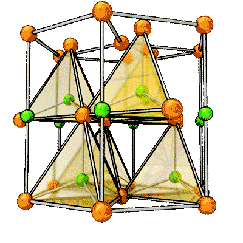
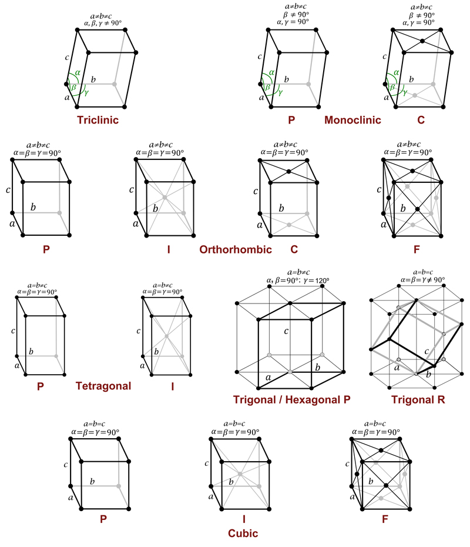

# Quantum-ATK

## Build

- **CIF** is a standard format for crystal structure information containing cell parameters, atomic positions and type   
- Basic concepts , Lattice, Basis 

- Bravais lattice 
-  Point group, Space group
-  Wyckoff positions

- https://www.cryst.ehu.es/

  

  

--------------------

### Tasks

- [ ] Search a crystal from DataBase

  - Make a rutile TiO2 
  - Find Si compounds in DB

- [ ] Search in Material Project

  - Google your structure cif and download standard cif
  - Explore data prepared in Material project

- [ ] Start editing structure in ATK

  - Change cell parameters and atomic position
  - Delete/Replace one of the atoms (group of atoms)

- [ ] Create surface models (Slab)

  - for a rutile TiO2 make 101, 100 slabs
  - add a molecule on your slab

  

## Set-up

## Submit

## Analyze

