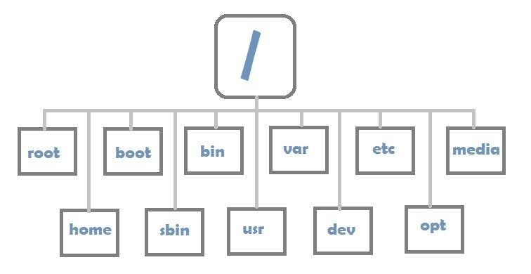

# LINUX CRASH COURSE

## Course Agenda

- Session 1: Introduction to Linux  *(35 min)*

  - History of Linux
  - Linux vs windows
  - Linux Distributions
    

- Session 2: Installation and Customization  *(45~100  min !!!)*

  - Installation alongside other OS
  - Installation using Vitrual-Box (Recommended for beginners)
  - Customization (What is most necessary packages?)
    

- Session 3: Linux from graphical point of view *(75 min)*

  - Pre-packed OS

  - Alternatives for Windows Programs (office, gimp, inkscape)

    

- Session 4: Linux from shell point of view *(2 x 45 min)*

  - Terminal
  - Commands
  - Shell-scripting

## What is Linux File System?

Linux file system is the collection of data and/or files stored in a computer’s hard disk or storage, your computer relies on this file system to ascertain the location and positioning of files in your storage, were it not there, the files would act as if they are invisible, obviously causing many problems. There are actually many different file systems that exist for Linux, if you’re wondering which one you should use, we will provide a comprehensive list of the file systems that are supported by Linux.

---------------------------------------------------------

# Linux Cheat Sheet

## File Commands:

 * ls – directory listing

 * ls -al – formatted listing with hidden files

 * cd dir - change directory to dir

 * cd – change to home

 * pwd – show current directory

 * mkdir dir – create a directory dir

 * rm file – delete file

 * rm -r dir – delete directory dir

 * rm -f file – force remove file

 * rm -rf dir – force remove directory dir *

 * cp file1 file2 – copy file1 to file2

 * cp -r dir1 dir2 – copy dir1 to dir2; create dir2 if it doesn't exist

 * mv file1 file2 – rename or move file1 to file2 if file2 is an existing directory, moves file1 into directory file2

 * ln -s file link – create symbolic link link to file

 * touch file – create or update file

 * cat > file – places standard input into file

 * more file – output the contents of file

 * head file – output the first 10 lines of file

 * tail file – output the last 10 lines of file

 * tail -f file – output the contents of file as it grows, starting with the last 10 lines  

   

   

## Process Management:

 * ps – display your currently active processes
 * top – display all running processes
 * kill pid – kill process id pid
 * killall proc – kill all processes named proc *
 * bg – lists stopped or background jobs; resume a stopped job in the background
 * fg – brings the most recent job to foreground
 * fg n – brings job n to the foreground

## System Information:

 * date – show the current date and time
 * cal – show this month's calendar
 * uptime – show current uptime
 * w – display who is online
 * whoami – who you are logged in as
 * finger user – display information about user
 * uname -a – show kernel information
 * cat /proc/cpuinfo – cpu information
 * cat /proc/meminfo – memory information
 * man command – show the manual for command
 * df – show disk usage
 * du – show directory space usage
 * free – show memory and swap usage
 * whereis app – show possible locations of app
 * which app – show which app will be run by default

## Network:

 * ping host – ping host and output results
 * whois domain – get whois information for domain
 * dig domain – get DNS information for domain
 * dig -x host – reverse lookup host
 * wget file – download file
 * wget -c file – continue a stopped download

## Shortcuts:

 * Ctrl+C – halts the current command
 * Ctrl+Z – stops the current command, resume with
 * fg in the foreground or bg in the background
 * Ctrl+D – log out of current session, similar to exit
 * Ctrl+W – erases one word in the current line
 * Ctrl+U – erases the whole line
 * Ctrl+R – type to bring up a recent command
 * !! - repeats the last command
 * exit – log out of current session

## SSH: 

 * ssh user@host – connect to host as user
 * ssh -p port user@host – connect to host on port port as user
 * ssh-copy-id user@host – add your key to host for user to enable a keyed or passwordless login
 * scp filename   user@host:/path/     copy file from client to a certain path in host

## Searching

 * grep pattern files – search for pattern in files
 * grep -r pattern dir – search recursively for pattern in dir
 * command | grep pattern – search for pattern in the output of command
 * locate file – find all instances of file

------------------

## File Permissions 

 * chmod octal file – change the permissions of file to octal, which can be found separately for user, group, and world by adding:
 * 4 – read (r)
 * 2 – write (w)
 * 1 – execute (x)

### Examples

 * chmod 777 – read, write, execute for all
 * chmod 755 – rwx for owner, rx for group and world

