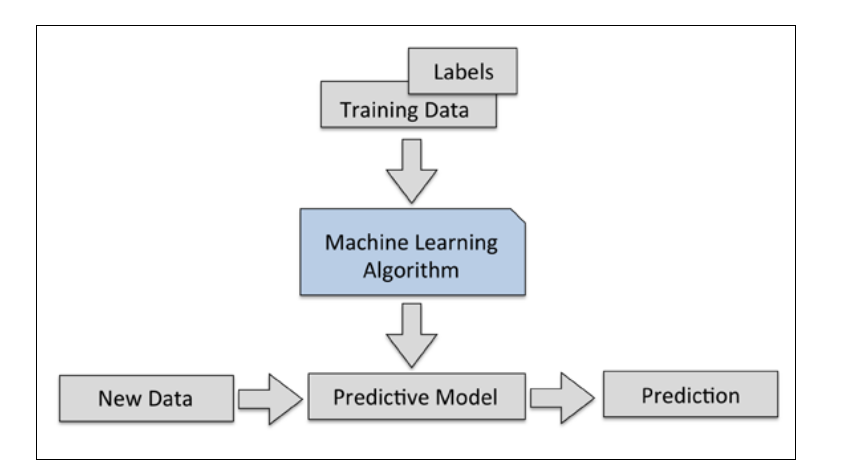
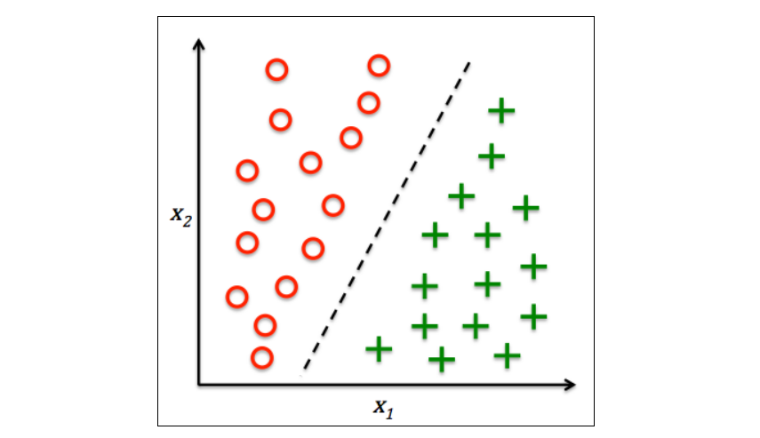

# Introduction to Machine Learning

## Types of ML

## Making predictions with Supervised Learning

Here, the term supervised refers to a set of samples where the desired output signals (labels) are
already known.

For example email with `spam` or `non-spam` labels and predicting the class of new email is a sample of **classification**

Another subcategory of supervised learning is **regression**, where the outcome signal is a continuous value

A sample two-dimensional data binary classification

--------------------------------

## Regression for predicting continuous outcomes

In
regression analysis, we are given a number of **predictor (explanatory)** variables and a continuous **response variable (outcome)**, and we try to find a relationship between those variables that allows us to predict an outcome.

