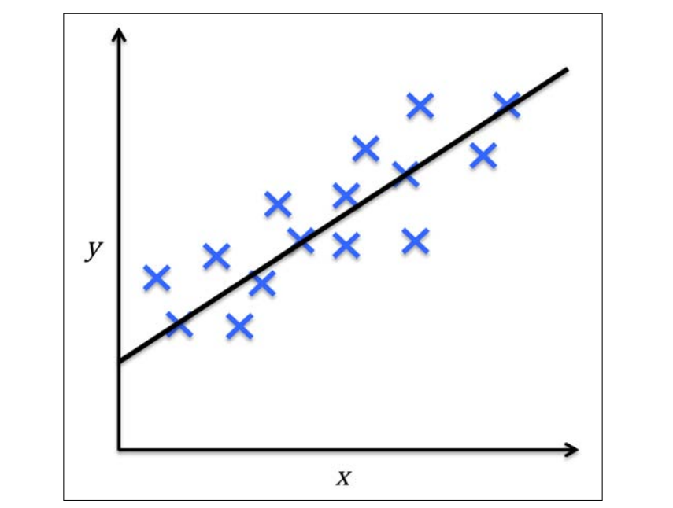
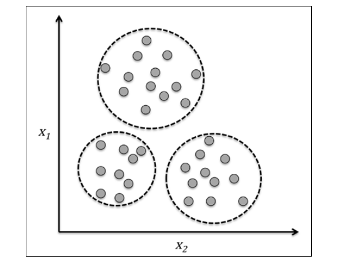
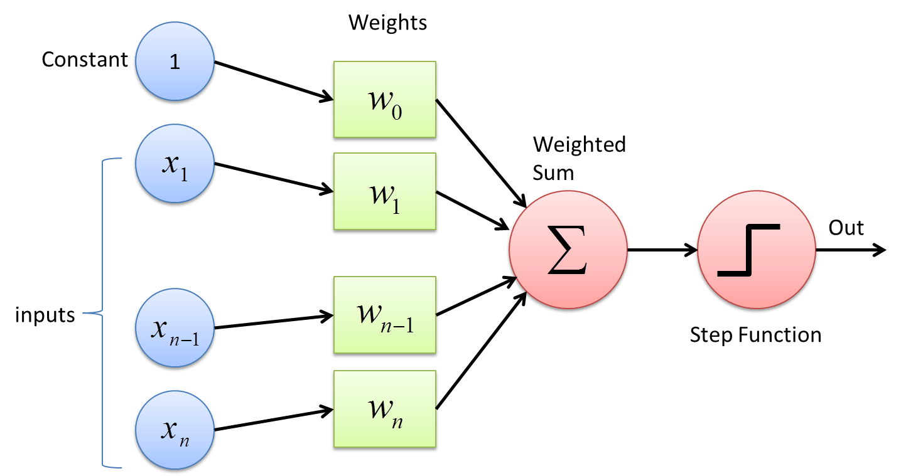

# Introduction to Machine Learning

## Types of ML

## Making predictions with Supervised Learning

Here, the term supervised refers to a set of samples where the desired output signals (labels) are
already known.

For example email with `spam` or `non-spam` labels and predicting the class of new email is a sample of **classification**

Another subcategory of supervised learning is **regression**, where the outcome signal is a continuous value

A sample two-dimensional data binary classification

--------------------------------

## Regression for predicting continuous outcomes

In
regression analysis, we are given a number of **predictor (explanatory)** variables and a continuous **response variable (outcome)**, and we try to find a relationship between those variables that allows us to predict an outcome.

## Reinforcement learning

## Unsupervised learning

Simple 2D clustering example based on the similarity of their features x1 and x2

## Dimensionality reduction for data compression

$x^{(i)}_j$ we will use the superscript **(i)** to refer to the ith training sample, and the subscript **j** to refer to the jth dimension of the training dataset.

## A roadmap for building machine learning systems

## Preprocessing – getting data into shape

**preprocessing**  ;  transforming the features in the range [0,1] or normal distribution

 for coorelated and redundant data -->  dimensionality reduction techniques

## Training and selecting a predictive model

One legitimate question to ask is: how do we know which model performs well on the final test data-set and real-world data if we don't use this test set for the model selection but keep it for the final model evaluation?

inally, we also cannot expect that the default parameters of the different learning algorithms provided by software libraries are
optimal for our specific problem task.  hyperparameter optimization techniques

## Evaluating models and predicting unseen data instances

------------------------------------

==============================

#  Chapter 2: Classification

The Perceptron algorithm learns the weights for the input signals in order to draw a linear decision boundary.

Basic concepts

- activation function
- weight

