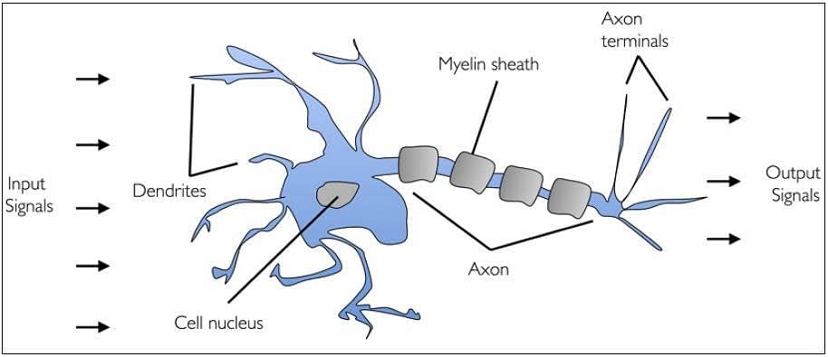
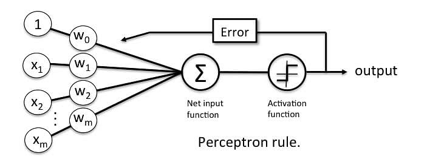

Basic cocepts
===============================

The Perceptron is a linear machine learning algorithm for binary classification tasks.

It may be considered one of the first and one of the simplest types of artificial neural networks. It is definitely not “deep” learning but is an important building block.

Perceptron Algorithm
----------------------------------

The Perceptron algorithm is a two-class (binary) classification machine learning algorithm.

It is a type of neural network model, perhaps the simplest type of neural network model.

It consists of a single node or neuron that takes a row of data as input and predicts a class label. 
This is achieved by calculating the weighted sum of the inputs and a bias (set to 1). 
The weighted sum of the input of the model is called the activation.

- Activation = Weights * Inputs + Bias

If the activation is above **threshold**, the model will output 1.0; otherwise, it will output 0.0.

The Perceptron is a linear classification algorithm. This means that it learns a decision boundary that separates two classes using a line (called a **hyperplane**)
in the feature space. As such, it is appropriate for those problems where the classes can be separated well by a line or linear model, 
referred to as linearly separable.

Examples from the training dataset are shown to the model one at a time, the model makes a prediction, and error is calculated. The weights of the model are then updated to reduce the errors for the example. This is called the Perceptron update rule. This process is repeated for all examples in the training dataset, called an epoch. This process of updating the model using examples is then repeated for many epochs.

Model weights are updated with a small proportion of the error each batch, and the proportion is controlled by a hyperparameter called the learning rate, typically set to a small value. This is to ensure learning does not occur too quickly, resulting in a possibly lower skill model, referred to as premature convergence of the optimization (search) procedure for the model weights.

`weights(t + 1) = weights(t) + learning_rate * (expected_i – predicted_) * input_i`
Training is stopped when the error made by the model falls to a low level or no longer improves, or a maximum number of epochs is performed.

.. note:: 

    The learning rate and number of training epochs are hyperparameters of the algorithm that can be set using heuristics or hyperparameter tuning.

Hands-on
~~~~~~~~~~~~~~~~~~~~~~~~~~~~~~~~~~~~~~~~~~

How to Implement the Perceptron Algorithm From Scratch in Python

.. code-block:: python

    #!/usr/bin/env python3
    # -*- coding: utf-8 -*-
    """
    Created on Sat Aug 20 14:52:27 2022

    @author: yavar
    """

    import numpy as np

    class Perceptron(object):
        """Perceptron classifier.
        Parameters
        ------------
        eta : float
        Learning rate (between 0.0 and 1.0)
        n_iter : int
        Passes over the training dataset.
        Attributes
        -----------
        w_ : 1d-array
        Weights after fitting.
        errors_ : list
        Number of misclassifications in every epoch.
        """
        def __init__(self, eta=0.01, n_iter=10):
            self.eta = eta
            self.n_iter = n_iter
            
        def fit(self, X, y):
            
                
            """Fit training data.
            Parameters
            ----------
            X : {array-like}, shape = [n_samples, n_features]
            Training vectors, where n_samples
            is the number of samples and
            n_features is the number of features.
            y : array-like, shape = [n_samples]
            Target values.
            Returns
            -------
            self : object
            """ 
            self.w_ = np.zeros(1 + X.shape[1])
            self.errors_ = []
            for _ in range(self.n_iter):
                errors = 0
                for xi, target in zip(X, y):
                    update = self.eta * (target - self.predict(xi))
                    self.w_[1:] += update * xi
                    self.w_[0] += update
                    errors += int(update != 0.0)
                self.errors_.append(errors)
            return self
        
        def net_input(self, X):
            """Calculate net input"""
            return np.dot(X, self.w_[1:]) + self.w_[0]
        def predict(self, X):
            """Return class label after unit step"""
            return np.where(self.net_input(X) >= 0.0, 1, -1)
            

After creation of above class we can use it 

.. code-block:: python

    #!/usr/bin/env python3
    # -*- coding: utf-8 -*-
    """
    Created on Sat Aug 20 14:52:27 2022

    @author: yavar
    """

    from percept import *
    import matplotlib.pyplot as plt
    import numpy as np
        
        
    import pandas as pd

    df = pd.read_csv("iris.data") 
        
        
    y = df.iloc[0:100, 4].values
        
    y = np.where(y == 'Iris-setosa', -1, 1)
        
        
    X = df.iloc[0:100, [0, 2]].values
        

    # plt.scatter(X[:50, 0], X[:50, 1], color='red', marker='o', label='setosa')
        
    # plt.scatter(X[50:100, 0], X[50:100, 1],color='blue', marker='x', label='versicolor')
    # plt.xlabel('petal length')
    # plt.ylabel('sepal length')
    # plt.legend(loc='upper left')
    #plt.show()

    ppn = Perceptron(eta=0.1, n_iter=10)

    jj=ppn.fit(X, y)

    plt.plot(range(1, len(ppn.errors_) + 1), ppn.errors_,marker='o')

    plt.xlabel('Epochs')

    plt.ylabel('Number of misclassifications')

    plt.show()

here is coode run result

.. image:: images/pract1.png
    :width: 400

