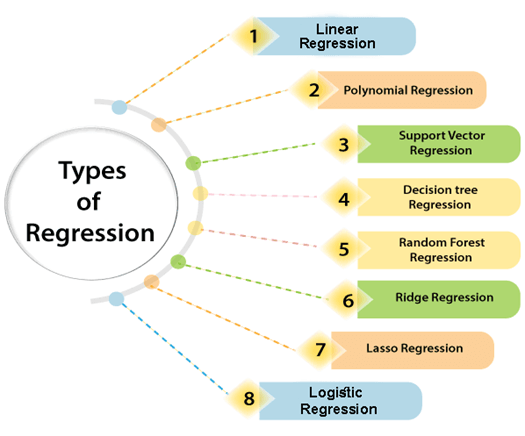
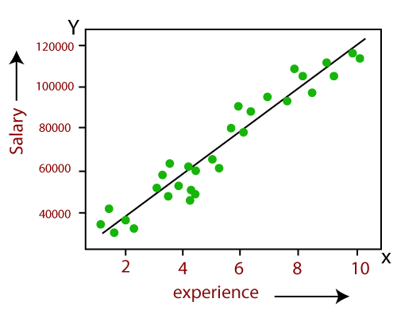
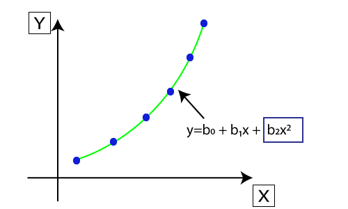
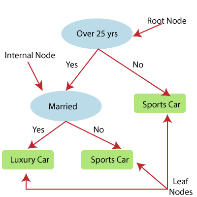

Regression Analysis in ML
==================================

Regression analysis is a statistical method to model the relationship between a dependent (target) 
and independent (predictor) variables with one or more independent variables. More specifically, 
Regression analysis helps us to understand how the value of the dependent variable is changing
corresponding to an independent variable when other independent variables are held fixed.
It predicts continuous/real values such as temperature, age, salary, price, etc.

In Regression, we plot a graph between the variables which best fits the given datapoints, using this plot, the machine learning model can make predictions about the data. In simple words, "Regression shows a line or curve that passes through all the datapoints on target-predictor graph in such a way that the vertical distance between the datapoints and the regression line is minimum." The distance between datapoints and line tells whether a model has captured a strong relationship or not.

Some examples of regression can be as:

- Prediction of rain using temperature and other factors
- Determining Market trends
- Prediction of road accidents due to rash driving.

Basic terminology
---------------------------------

- Dependent Variable: The main factor in Regression analysis which we want to predict or understand is called the dependent variable. It is also called target variable.
- Independent Variable: The factors which affect the dependent variables or which are used to predict the values of the dependent variables are called independent variable, also called as a predictor.
- Outliers: Outlier is an observation which contains either very low value or very high value in comparison to other observed values. An outlier may hamper the result, so it should be avoided.
- Multicollinearity: If the independent variables are highly correlated with each other than other variables, then such condition is called Multicollinearity. It should not be present in the dataset, because it creates problem while ranking the most affecting variable.
- Underfitting and Overfitting: If our algorithm works well with the training dataset but not well with test dataset, then such problem is called Overfitting. And if our algorithm does not perform well even with training dataset, then such problem is called underfitting.

Types of regression
---------------------------------------

- Linear Regression
- Logistic Regression
- Polynomial Regression
- Support Vector Regression
- Decision Tree Regression
- Random Forest Regression
- Ridge Regression
- Lasso Regression:

Each method can be used for different scenario

Linear regression
~~~~~~~~~~~~~~~~~~~~~~~~~~~~~~~~~~~~~~~~
Linear regression shows the linear relationship between the independent variable (X-axis) and the dependent variable (Y-axis), hence called linear regression.

a mathematical euqation for regression can bes shown

.. math:: 

    Y= aX+b  

| Here, Y = dependent variables (target variables),  
| X= Independent variables (predictor variables),  
| a and b are the linear coefficients  

Polynomial Regression
~~~~~~~~~~~~~~~~~~~~~~~~~~~~~~~~~~~~~~~~~~~

Polynomial Regression is a type of regression which models the non-linear dataset using a linear model.
It is similar to multiple linear regression, but it fits a non-linear curve between the value of x and corresponding conditional values of y.

.. note::
    
    In Polynomial regression, the original features are transformed into polynomial features of given degree and then modeled using a linear model. Which means the datapoints are best fitted using a polynomial line.

Logistic Regression
~~~~~~~~~~~~~~~~~~~~~~~~~~~~~~~~~

- Logistic regression is another supervised learning algorithm which is used to solve the classification problems. In classification problems, we have dependent variables in a binary or discrete format such as 0 or 1.
- Logistic regression algorithm works with the categorical variable such as 0 or 1, Yes or No, True or False, Spam or not spam, etc.
- Logistic regression uses sigmoid function or logistic function which is a complex cost function. This sigmoid function is used to model the data in logistic regression. The function can be represented as
  
  .. math:: 

    f(x)=\frac{1}{1+e^{-x}}

where, f(x)= Output between the 0 and 1 value and x= input to the function

Support Vector Regression
~~~~~~~~~~~~~~~~~~~~~~~~~~~~~~~~~~~~~~

Decision Tree Regression
~~~~~~~~~~~~~~~~~~~~~~~~~~~~~~~~~~~~~~

Decision Tree is a supervised learning algorithm which can be used for solving both classification and regression problems.

